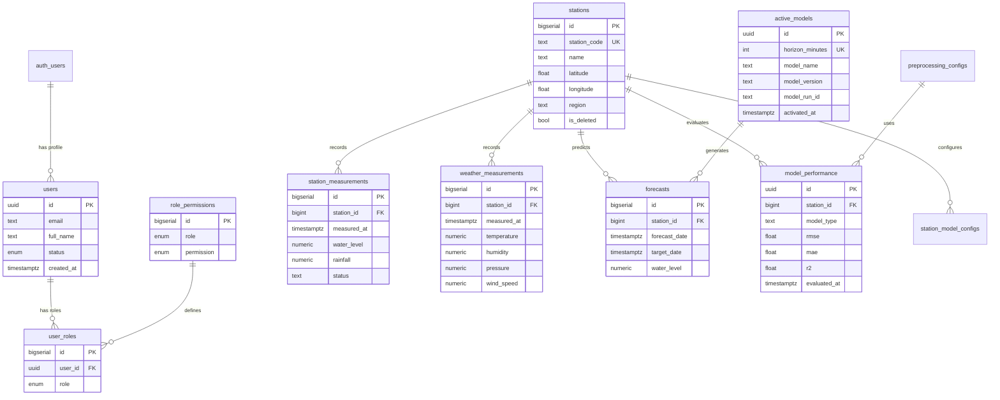

# SWFM Technical Documentation

## Table of Contents

- [1. Introduction](#1-introduction)
- [2. System Architecture](#2-system-architecture)
- [3. Database Design](#3-database-design)
- [4. RBAC Implementation](#4-rbac-implementation)
- [5. Data Flow](#5-data-flow)
- [6. Technology Stack](#6-technology-stack)
- [7. Security & Authorization](#7-security--authorization)
- [8. Operational Workflows](#8-operational-workflows)

---

## 1. Introduction

SWFM (Smart Water Forecasting Management) is a production-ready water level forecasting system for the Mekong River monitoring stations. The system employs a microservices architecture combining a Next.js frontend, FastAPI ML service, MLflow experiment tracking, and Supabase/PostgreSQL backend with comprehensive role-based access control.

### Key Features

- **Multi-horizon Forecasting**: Predictions for 15, 30, 45, and 60-minute intervals
- **Automated ML Pipeline**: Scheduled training and prediction generation
- **Real-time Data Integration**: Hourly weather updates and 15-minute station measurements
- **Role-Based Access Control**: Three-tier permission system with database-level enforcement
- **Experiment Tracking**: Complete MLflow integration for model versioning and metrics
- **Monorepo Architecture**: Turborepo-managed workspace with pnpm

---

## 2. System Architecture

### 2.1 High-Level Architecture


### 2.2 Service Communication


### 2.3 Docker Service Architecture

The application runs as containerized services orchestrated by Docker Compose:

| Service | Technology | Port | Purpose | Dependencies |
|---------|-----------|------|---------|--------------|
| **nextjs** | Next.js 16 | 3000 | Frontend web application | ml-api |
| **ml-api** | FastAPI | 8000 | ML REST API service | mlflow |
| **ml-trainer** | Python | - | Background auto-trainer | ml-api |
| **mlflow** | MLflow 2.9 | 5000 | Experiment tracking server | mlflow-postgres |
| **mlflow-postgres** | PostgreSQL 14 | 5432 | MLflow backend storage | - |

**Shared Network**: All services communicate via `swfm-network` (bridge driver)

**Persistent Volumes**:
- `mlflow-pgdata`: MLflow database persistence
- `mlflow-artifacts`: Model artifacts and experiment files
- `ml-models`: Trained model storage
- `ml-logs`: Training and prediction logs

---

## 3. Database Design

### 3.1 Schema Overview



### 3.2 Core Tables

#### Authentication & Users
- **auth.users**: Managed by Supabase Auth (email/password)
- **public.users**: User profiles with approval status (pending/active/rejected)
- **public.user_roles**: User-to-role assignments (many-to-many)
- **public.role_permissions**: Role-to-permission mappings

#### Station Data
- **stations**: Monitoring station metadata (location, thresholds)
- **station_measurements**: Water level and rainfall data (15-minute sync)
- **weather_measurements**: OpenWeather API data (hourly sync)
- **forecasts**: Generated predictions with target timestamps

#### ML Model Management
- **model_performance**: Stored evaluation metrics (RMSE, MAE, R²)
- **station_model_configs**: Per-station model configurations
- **active_models**: Currently deployed models by horizon
- **preprocessing_configs**: Feature engineering settings

### 3.3 Key Design Patterns

**Soft Deletes**: Stations use `is_deleted` flag instead of hard deletion

**Upserts**: Measurements use `ON CONFLICT DO UPDATE` for idempotency

**Composite Keys**: Measurements use `(station_id, measured_at)` uniqueness

**Audit Trails**: `created_at` and `updated_at` timestamps on configuration tables

**Enum Types**: Custom PostgreSQL enums for roles, permissions, and status values

---

## 4. RBAC Implementation

### 4.1 Role Hierarchy


### 4.2 Permission Matrix

| Permission | Admin | Expert (Data Scientist) | Guest |
|-----------|-------|-------------------------|-------|
| **users.manage** | ✅ | ❌ | ❌ |
| **data.manage** | ✅ | ❌ | ❌ |
| **models.tune** | ✅ | ✅ | ❌ |
| **data.download** | ✅ | ✅ | ❌ |
| View Dashboard | ✅ | ✅ | ✅ |
| View Forecasts | ✅ | ✅ | ✅ |
| View Stations | ✅ | ✅ | ✅ |

### 4.3 Authorization Layers

**Layer 1: Database RLS (Row Level Security)**
- All tables have RLS policies enabled
- `authorize(permission, user_id)` function validates permissions via role_permissions join
- Policies enforce read/write access at the database level

**Layer 2: API Authorization**
- FastAPI endpoints use Supabase service role key
- No additional API-level auth (relies on client auth)
- ML operations assume authenticated requests from web app

**Layer 3: Frontend Guards**
- `AuthProvider` fetches user role and status on mount
- Role mapping: `admin` (DB) → `admin` (UI), `data_scientist` (DB) → `expert` (UI)
- Sidebar navigation filtered by role
- Protected pages redirect non-authorized users
- Components conditionally rendered based on permissions

### 4.4 First User Bootstrap

The system implements automatic admin assignment for the first user:

1. **Trigger**: `on_auth_user_created` fires after Supabase auth registration
2. **Function**: `handle_new_user()` checks total user count
3. **First User**: Receives `admin` role + `active` status automatically
4. **Subsequent Users**: Assigned `data_scientist` role + `pending` status
5. **Admin Approval**: Admin changes status from `pending` to `active` or `rejected`

---

## 5. Data Flow

### 5.1 User Authentication Flow


### 5.2 ML Training Workflow


### 5.3 Prediction Generation Flow


### 5.4 Data Synchronization Flow


### 5.5 Model Activation Flow


---

## 6. Technology Stack

### 6.1 Frontend Architecture

**Framework**: Next.js 16 (App Router + React Server Components)

**Key Technologies**:
- **React 19**: UI library with latest concurrent features
- **TypeScript 5.9**: Type safety across the application
- **Tailwind CSS 4**: Utility-first styling with v4 engine
- **shadcn/ui**: Radix UI-based component library
- **Supabase Client**: Real-time subscriptions and database access
- **Recharts 3**: Data visualization for time-series charts
- **React Leaflet**: Interactive maps for station locations
- **TanStack Table 8**: Advanced data table with sorting/filtering
- **React Hook Form + Zod**: Type-safe form validation

**Architectural Patterns**:
- Server Components for data fetching (default)
- Client Components for interactivity (`'use client'`)
- Server Actions for mutations (`'use server'`)
- Route Groups for layout organization (`(protected-pages)`)
- Parallel Routes for modals (optional)

### 6.2 Backend Architecture

**Framework**: FastAPI (async ASGI)

**Key Technologies**:
- **Uvicorn**: ASGI server with auto-reload in dev
- **Pydantic 2**: Data validation and serialization
- **MLflow 2.9**: Experiment tracking and model registry
- **Scikit-learn**: ML models (Linear, Ridge, StandardScaler)
- **Pandas**: Data manipulation and feature engineering
- **NumPy**: Numerical operations
- **Supabase Client**: Database access from Python
- **Schedule**: Cron-like job scheduling for auto-trainer

**API Design Patterns**:
- RESTful endpoints with OpenAPI docs
- Router-based modularization (by domain)
- Pydantic schemas for request/response
- Service layer for business logic
- Dependency injection for shared resources

### 6.3 ML Pipeline

**Model Types**:
- Linear Regression (baseline)
- Ridge Regression (primary, with regularization)

**Feature Engineering** (9 configurable methods):
1. Lag Features (1h, 2h, 3h, 6h, 12h, 24h)
2. Rolling Statistics (mean, std, min, max)
3. Rate of Change (water level diff)
4. Time Features (hour, day, month, cyclical encoding)
5. Rainfall Aggregations (1h, 6h, 12h, 24h)
6. Weather Features (temperature, humidity, pressure)
7. Wind Features (speed, direction)
8. Interaction Features (rain × temperature)
9. Historical Averages

**MLflow Integration**:
- Experiment tracking (params, metrics, artifacts)
- Model registry (versioning, staging, production)
- Artifact storage (models, scalers, feature configs)
- PostgreSQL backend for metadata
- File system for artifacts

### 6.4 Database & Storage

**Primary Database**: Supabase (managed PostgreSQL 14+)
- Row Level Security (RLS) enabled on all tables
- Custom `authorize()` function for RBAC
- Generated TypeScript types via Supabase CLI
- Real-time subscriptions (optional)
- Edge Functions for serverless operations

**Extensions**:
- `pg_cron`: Scheduled jobs (data sync)
- `pg_net`: HTTP requests from database
- `uuid-ossp`: UUID generation
- `pgcrypto`: Cryptographic functions

**MLflow Storage**:
- Backend Store: PostgreSQL (mlflow-postgres container)
- Artifact Store: File system (`/app/mlartifacts`)

### 6.5 DevOps & Tooling

**Monorepo Management**:
- Turborepo: Build orchestration with caching
- pnpm 10: Fast, disk-efficient package manager
- Workspace Protocol: Cross-package dependencies

**Containerization**:
- Docker: Multi-stage builds for production
- Docker Compose: Local development orchestration
- Shared networks and volumes
- Health checks for service dependencies

**Code Quality**:
- TypeScript: Strict mode with noEmit checks
- ESLint: Linting rules for Next.js
- Prettier: Code formatting
- Git hooks (optional): Pre-commit checks

---

## 7. Security & Authorization

### 7.1 Authentication Strategy

**Provider**: Supabase Auth (built-in)

**Methods Supported**:
- Email/Password (currently active)
- OAuth providers (configurable)
- Magic links (configurable)

**Session Management**:
- JWT tokens stored in HTTP-only cookies
- Server-side validation via `createClient()`
- 1-hour expiry with automatic refresh

### 7.2 Row Level Security (RLS)

**Design Philosophy**: Database is the source of truth for authorization

**Implementation**:
- All tables have `ALTER TABLE ... ENABLE ROW LEVEL SECURITY`
- Policies use `auth.uid()` to identify current user
- `authorize(permission, user_id)` function validates via role_permissions join
- Policies are declarative and auditable

**Policy Patterns**:
```sql
-- Public read access
CREATE POLICY "Allow public read" ON [table]
    FOR SELECT USING (true);

-- Admin-only write
CREATE POLICY "Allow admin write" ON [table]
    FOR INSERT WITH CHECK (authorize('data.manage', auth.uid()));

-- Expert-level access
CREATE POLICY "Allow expert access" ON [table]
    FOR ALL USING (
        authorize('models.tune', auth.uid()) OR 
        authorize('data.manage', auth.uid())
    );
```

### 7.3 Frontend Security

**Route Protection**:
- Middleware redirects unauthenticated users to `/auth/login`
- Protected pages check `role` and redirect if insufficient
- Server Actions validate auth before mutations

**Data Access**:
- Client-side Supabase queries respect RLS
- Server Actions use server-side client with service role (when needed)
- Sensitive operations (user management) require admin role

**Environment Variables**:
- Public vars: `NEXT_PUBLIC_SUPABASE_URL`, `NEXT_PUBLIC_SUPABASE_PUBLISHABLE_OR_ANON_KEY`
- Server-only vars: `SUPABASE_SERVICE_ROLE_KEY` (for admin operations)

### 7.4 API Security

**ML API Service**:
- No public endpoints (only accessible via internal network)
- CORS configured for Next.js origin only
- Supabase service role key for database access
- Input validation via Pydantic schemas

**MLflow Server**:
- Internal network only (not exposed publicly)
- PostgreSQL credentials via environment variables
- Artifact access restricted to service layer

---

## 8. Operational Workflows

### 8.1 Model Lifecycle


### 8.2 Data Pipeline Operations

**Daily Operations**:
- **00:00-23:45**: Sync station measurements every 15 minutes (96 syncs/day)
- **Every hour**: Sync weather data for all active stations (24 syncs/day)
- **Every 60 minutes**: Auto-trainer runs (trains + predicts)

**Data Quality**:
- Measurements have `status` field (verified/pending/rejected)
- Duplicate prevention via `UNIQUE(station_id, measured_at)`
- Soft deletes on stations preserve historical data
- Sync logs track success/error counts

### 8.3 Monitoring & Observability

**Application Logs**:
- Next.js: Console logs in browser, server logs in Docker
- ML API: Uvicorn access logs + application logs
- MLflow: Tracking server logs

**Docker Logs**:
```bash
# View all services
docker compose logs -f

# View specific service
docker compose logs -f ml-api
docker compose logs -f mlflow
```

**Database Monitoring**:
- Supabase Studio: Local dashboard at `http://localhost:54323`
- pg_cron logs in `cron.job_run_details`
- sync_logs table for external API status

**MLflow UI**:
- Experiment tracking: `http://localhost:5000`
- Model registry versioning
- Metrics comparison across runs

### 8.4 Deployment Workflow

**Local Development**:
1. Start Supabase: `pnpx supabase start`
2. Run database migrations: `pnpx supabase db reset`
3. Start web app: `pnpm dev` (Turborepo)
4. (Optional) Start ML service: `cd apps/ml-service && bash start_ml_service.sh`

**Docker Production**:
1. Configure environment variables (`.env` file)
2. Build and start: `docker compose up -d --build`
3. Verify health: Check logs and service endpoints
4. Initialize data: Run initial sync manually or wait for cron

**Database Migrations**:
- Managed by Supabase CLI
- Versioned SQL files in `supabase/migrations/`
- Applied in order by timestamp prefix
- Rollback via `supabase db reset` (dev only)

### 8.5 Scaling Considerations

**Horizontal Scaling**:
- Next.js: Stateless, can replicate behind load balancer
- ML API: Stateless prediction service, can scale with multiple instances
- MLflow: Single instance (artifact storage on shared volume)

**Database Optimization**:
- Indexed foreign keys and timestamp columns
- Partitioning for large tables (station_measurements, forecasts)
- Connection pooling via Supabase Pooler

**Caching Strategy**:
- Turborepo: Build cache for faster rebuilds
- Next.js: Static generation for public pages
- ML models: Loaded once per container lifecycle

---

## Appendix: Key File Locations

### Configuration Files
- `docker-compose.yml` - Service orchestration
- `turbo.json` - Build pipeline configuration
- `pnpm-workspace.yaml` - Monorepo workspace definition
- `apps/web/next.config.mjs` - Next.js configuration
- `apps/ml-service/requirements.txt` - Python dependencies

### Database Migrations
- `supabase/migrations/` - All database schema changes (ordered by timestamp)
- `supabase/seed.sql` - Initial data (stations, permissions)

### Application Code
- `apps/web/app/` - Next.js App Router pages
- `apps/web/components/` - React components
- `apps/web/lib/supabase/` - Database client and types
- `apps/ml-service/app/` - FastAPI application
- `apps/ml-service/app/routers/` - API endpoints
- `apps/ml-service/app/services/` - Business logic

### Infrastructure
- `apps/mlflow/Dockerfile` - Custom MLflow image
- `apps/web/Dockerfile` - Next.js production build
- `apps/ml-service/Dockerfile` - ML service image
- `.dockerignore` - Files excluded from Docker context
